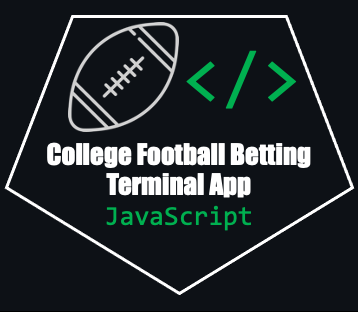

# College-Football-Betting-Javascript

  

## Overview
This repository contains source code allowing the user to simulate betting on American college football games in the terminal. It utilizes the [CFBD JavaScript API][1]. For more information regarding the CFBD APIs and databases, please refer to this [link][2]. This program offers the same functionality provided by the [College-Football-Betting-Python repository][4]. For more information about functionality, please refer to that repository.

## Installation and Usage
You can simply clone this reposity and run the script using accessing the app directory and running `node index.js`, assuming you have a [CFBD API key](https://collegefootballdata.com/key), created a .env file with a `api-token='<API-KEY>'` entry, and have Node installed. To install the required Node packages, run `npm install`.

## Bet Types
Two bet types are used in this program: point spread bets and total point bets (also known as over/under bets). For more information regarding the mechanics of these bets, refer to this [link][3].

## Use Case
This program provides a high-level framework for creating betting apps using the [CFBD API][2]. It could be further improved by adding UI, user error handling, etc. Currently, there are no further improvements expected to be implemented.

Imagery from [Flaticon.com](https://www.flaticon.com/)

[1]: https://github.com/CFBD/cfb.js "CFBD JavaScript API"
[2]: https://collegefootballdata.com/ "CFBD Website"
[3]: https://betandbeat.com/betting/american-football/#:~:text=American%20Football%20Odds,-Odds%20refer%20to&text=There%20are%20three%20types%20of,thing%2C%20only%20in%20different%20formats. "Bet Types Explained"
[4]: https://github.com/edavis0/college-football-betting-python "College-Football-Betting-Python"